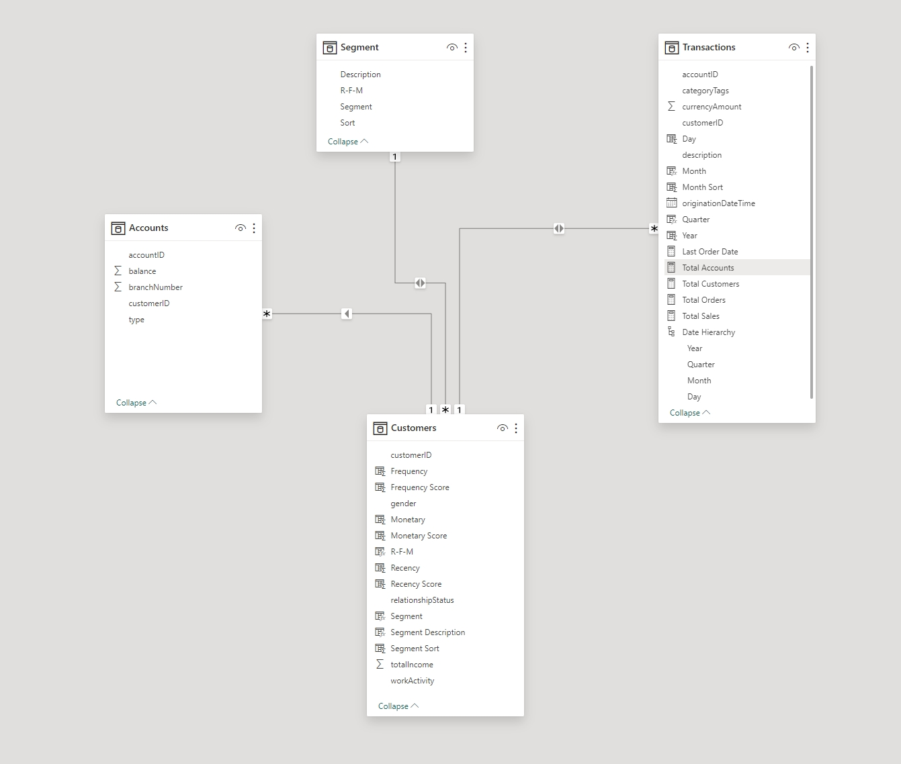

# PowerBI-RFM-Dashboard
## Table of Contents
- [1.Introduction](#1Introduction)
- [2.ETL Workflow](#2ETL-Workflow)
- [3.KPIs](#3KPIs)
- [4.Modeling](#4Modeling)
- [5.Results](#5Results)
- [6.Lesson Learned](#6Lesson-Learned)
## 1.Introduction
## 2.ETL Workflow
## 3.KPIs
Recency: How recently a customer has made a purchase

Frequency: How often a customer makes a purchase

Monetary Value: How much money a customer spends on purchases
## 4.Modeling 

## 5.Results

## 6.Lesson Learned

